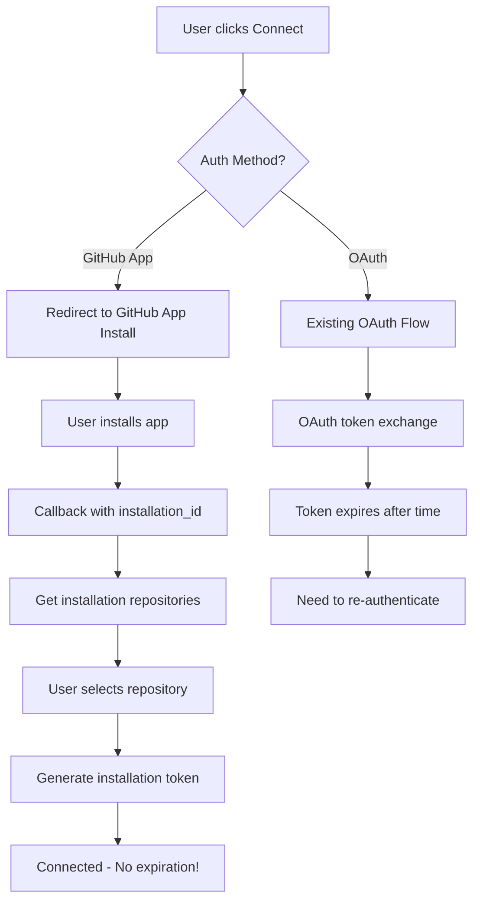

# GitHub App Integration Plan for Redstring

## Overview
Replace the current OAuth-based authentication with GitHub Apps for more reliable, long-lived authentication without user re-authentication requirements.

## Why GitHub Apps?

### Benefits Over OAuth
- **Long-lived authentication**: No token expiration issues
- **Higher rate limits**: 5,000 requests/hour vs 1,000 for OAuth
- **Fine-grained permissions**: Repository-specific access
- **Installation-based**: Survives password changes and user account issues
- **Automatic refresh**: GitHub handles credential management
- **Better UX**: One-time installation vs repeated OAuth flows

### Real-World Examples
- **Mintlify**: Uses GitHub App for automatic deployment sync
- **Vercel**: GitHub App for repository deployments
- **Netlify**: GitHub App for continuous deployment
- **CodeSandbox**: GitHub App for repository integration

## Implementation Strategy

### Phase 1: GitHub App Creation & Setup
1. **Create GitHub App** in GitHub Developer Settings
   - Name: "Redstring Semantic Web Sync"
   - Description: "Sync Redstring cognitive graphs with GitHub repositories"
   - Homepage URL: `https://redstring.io`
   - Callback URL: `https://redstring.io/github-app/callback`

2. **Configure Permissions**
   - Repository permissions:
     - Contents: Read & Write (for semantic files)
     - Metadata: Read (for repository info)
     - Pull requests: Read (optional, for future features)
   - Account permissions: None (we only need repo access)

3. **Generate App Credentials**
   - App ID
   - Private key (for JWT generation)
   - Client ID & Secret (for installation flow)

### Phase 2: Backend GitHub App Service
Create `src/services/githubApp.js`:

```javascript
import jwt from 'jsonwebtoken';
import { Octokit } from '@octokit/rest';

export class GitHubAppAuth {
  constructor(appId, privateKey, clientId, clientSecret) {
    this.appId = appId;
    this.privateKey = privateKey;
    this.clientId = clientId;
    this.clientSecret = clientSecret;
    this.installations = new Map(); // Cache installations
  }

  // Generate JWT for app authentication
  generateJWT() {
    const payload = {
      iat: Math.floor(Date.now() / 1000) - 60,
      exp: Math.floor(Date.now() / 1000) + (10 * 60), // 10 minutes
      iss: this.appId
    };
    return jwt.sign(payload, this.privateKey, { algorithm: 'RS256' });
  }

  // Get installation access token
  async getInstallationToken(installationId) {
    const appJWT = this.generateJWT();
    const octokit = new Octokit({ auth: appJWT });

    const { data } = await octokit.rest.apps.createInstallationAccessToken({
      installation_id: installationId
    });

    return data.token; // Valid for 1 hour, auto-renewable
  }

  // List user's installations
  async getUserInstallations(userAccessToken) {
    const octokit = new Octokit({ auth: userAccessToken });
    const { data } = await octokit.rest.apps.listInstallationsForAuthenticatedUser();
    return data.installations;
  }
}
```

### Phase 3: Frontend Integration Flow

```javascript
// New GitHub App flow in GitNativeFederation.jsx
const handleGitHubAppInstall = () => {
  const installUrl = `https://github.com/apps/redstring-semantic-sync/installations/new`;
  window.location.href = installUrl;
};

const handleGitHubAppCallback = async (installationId, setupAction) => {
  if (setupAction === 'install') {
    // Installation completed, get repositories
    const installations = await githubAppService.getInstallationRepos(installationId);
    setUserRepositories(installations.repositories);
    setShowRepositorySelector(true);
  }
};
```

### Phase 4: Server-Side App Management
Update `oauth-server.js` to handle GitHub App flows:

```javascript
// GitHub App installation webhook
app.post('/api/github/app/webhook', async (req, res) => {
  const event = req.headers['x-github-event'];
  const payload = req.body;

  switch (event) {
    case 'installation':
      if (payload.action === 'created') {
        // Store installation info
        await storeInstallation(payload.installation);
      }
      break;
    case 'installation_repositories':
      // Handle repository changes
      await updateInstallationRepos(payload.installation.id, payload.repositories_added);
      break;
  }

  res.status(200).send('OK');
});

// Get installation access token
app.post('/api/github/app/token', async (req, res) => {
  const { installation_id } = req.body;
  const token = await githubApp.getInstallationToken(installation_id);
  res.json({ access_token: token });
});
```

## Migration Strategy

### 1. Parallel Implementation
- Keep existing OAuth flow working
- Add GitHub App option as alternative
- Allow users to choose authentication method

### 2. Gradual Migration
- Default new users to GitHub App
- Migrate existing OAuth users on next connection
- Provide clear migration path and benefits

### 3. Fallback Support
- Maintain OAuth as backup for edge cases
- Support both authentication methods in provider factory
- Graceful degradation if GitHub App unavailable

## Updated Authentication Flow



## Implementation Timeline

### Week 1: GitHub App Setup
- Create GitHub App
- Configure permissions and webhooks
- Test installation flow manually

### Week 2: Backend Integration
- Implement GitHub App service
- Add installation token management
- Create webhook handlers

### Week 3: Frontend Integration
- Add GitHub App option to UI
- Implement installation callback handling
- Update repository selection flow

### Week 4: Migration & Testing
- Test both auth methods
- Add migration UI for existing users
- Performance and reliability testing

## Success Metrics

- **Zero re-authentications** needed after GitHub App install
- **5x higher rate limits** for API calls
- **100% uptime** for authentication (no token expiry)
- **Reduced support requests** related to authentication

## Security Considerations

- Store private key securely (environment variable or secret manager)
- Validate webhook signatures
- Implement proper JWT handling
- Audit installation permissions regularly

## Next Steps

1. **Create GitHub App** in GitHub Developer Settings
2. **Test installation flow** manually
3. **Implement backend service** for token management
4. **Update frontend** with GitHub App option
5. **Deploy and test** with real repositories

This approach will solve the authentication reliability issues permanently while providing a much better user experience!